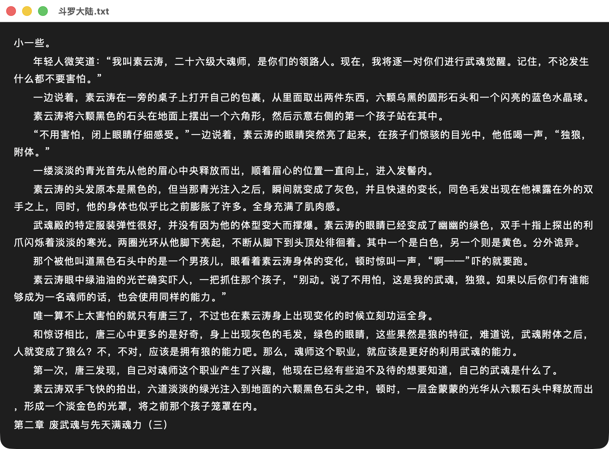
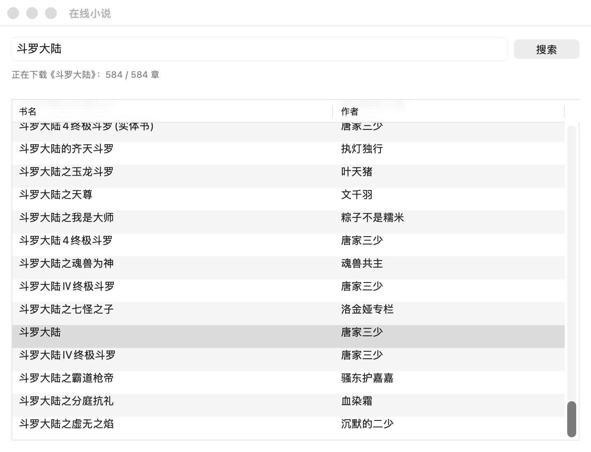

<p align="center">
  
</p>

<h1 align="center">摸鱼书摊</h1>

<p align="center">
  一个克制、好用的原生 macOS 小说阅读器 — 摸鱼时也能优雅看书。
</p>

<p align="center">
  <a href="#安装">安装</a> ·
  <a href="#特性总览">特性</a> ·
  <a href="#截图导览">截图</a> ·
  <a href="#快捷键">快捷键</a> ·
  <a href="#在线书源-bsjson">书源扩展</a>
</p>

---

- 🍎 **原生 AppKit + Core Text**，universal binary（arm64 + x86_64），**零第三方 UI 框架**
- ⚡️ 单一二进制 < 5 MB，冷启动 < 100 ms
- 📚 一站式：**搜书 → 整本下载 → 离线阅读**，全程不离开应用
- 🎛 字号 / 颜色 / 行距 / 透明度 / 快捷键全自定义，**改完即生效，无需重启**
- 🐟 摸鱼场景友好：无边框 / 整窗透明 / 全局热键一键显隐

## 截图导览

### ① 阅读界面 — Core Text 中文排版，无任何 UI 边距浪费



可见信息：
- **章节标题**自动识别，作为本地 TOC 的一项
- **首行缩进**、**段距**、**行距**、**字间距** 全独立可调（设置面板）
- 整窗背景与字色用户可换；图中是默认夜读色（暗背景 + 米色字）
- 标题栏只留必要按钮，无边框模式下连标题栏都能藏

---

### ② 在线搜书 + 整本并发下载



可见信息：
- 搜索框一栏简洁 UI，**没有"书源"概念**（内部维护，用户透明）
- 搜索结果列：**书名 + 作者**
- 双击任意结果触发整本下载，下方进度条「**正在下载《斗罗大陆》：584 / 584 章**」
- 6 路并发抓取，进度条 + 取消按钮垂直对齐于状态文字 + 进度条 block
- 完成后窗口自动关闭，主阅读器从「第 1 章」打开本地大文件

---

> 阅读界面色彩配色、设置面板、跳章菜单等更多截图可丢入 `docs/screenshots/` 后再 PR。

## 特性总览

### 阅读体验
- 自动识别 **.txt / .epub / .mobi / .azw / .azw3** 格式
- 智能章节解析：「第 X 章 / 卷 / 节」、「楔子」、「序章」自动建目录
- 字号 / 字间距 / 行距 / 段距 / 首行缩进 实时可调（设置即生效）
- 自定义文字颜色 + 背景色 + 整窗透明度（Ctrl + 滚轮调节）
- 无边框模式 / 窗口置顶模式
- 自动翻页（可设秒数）

### 在线小说（笔趣阁源内置）
- 搜索框输入书名/作者，**回车多源并发搜索**
- 双击任意搜索结果 → 整本**并发下载到本地**（6 路并发，500+ 章实测可控）
- 进度条 + 可随时取消
- 下载后**所有阅读 = 离线本地阅读**：自由翻页、跳任意章、断网不影响
- 章节目录自动从 .txt 解析（不依赖站点）

### 数据持久化
- 每本书独立阅读位置记忆，重启自动接着读
- 每本书独立书签（Cmd + M 添加，按位置跳转）
- 最近阅读列表（最多 20 本，区分在线下载 vs 本地导入）
- 显示设置 / 快捷键 / 窗口风格 等全部持久化

### 自定义快捷键
- 显隐 / 翻页 / 跳章 / 自动翻页 / 字号 / 设置 …… 12 + 个操作全部可重新绑定
- 在「设置 → 快捷键」面板里改完立即生效，**无需重启 App**
- 支持组合键 + 全局热键（Carbon RegisterEventHotKey 注入）

### 清晰的本地数据布局
```
~/Library/Application Support/MoyuShutan/
└── books/                 # 在线下载的整本 .txt（清最近阅读时一并删除）
    └── <书名>.txt
```
- 用户从本地拖入的书不动这里，纯外部引用
- 「清除最近记录」只删 App 自己下的，不动用户文件

## 安装

### 方式 1：从源码编译（开发者推荐）

```bash
git clone https://github.com/WeirdoMeng/Reader-Mac.git
cd Reader-Mac

# 配置 + 编译
cmake -S ReaderCore -B build -DCMAKE_BUILD_TYPE=Release \
      -DCMAKE_OSX_ARCHITECTURES="arm64;x86_64"
cmake --build build -j

# 启动
open "build/ReaderApp/摸鱼书摊.app"
```

依赖：Xcode Command Line Tools、CMake ≥ 3.20。

### 方式 2：DMG 一键安装包

```bash
./scripts/make_dmg.sh 0.2.0   # 生成 dist/MoyuShutan-0.2.0.dmg
```

挂载 DMG 拖到 Applications。因未购买 Apple 开发者签名，首次启动可能被 Gatekeeper 拦：

**方案 A**：右键 App → 选 **打开** → 弹窗里确认。
**方案 B**：终端剥离 quarantine 属性：

```bash
xattr -dr com.apple.quarantine "/Applications/摸鱼书摊.app"
```

### 方式 3：Homebrew Cask（推荐 ⭐）

```bash
brew tap WeirdoMeng/tap
brew install --cask moyushutan
```

完成 → App 自动装到 `/Applications/摸鱼书摊.app`，菜单栏可直接启动。

> 若首次启动被 Gatekeeper 拦截「无法验证开发者」，终端跑一条剥 quarantine：
> ```bash
> xattr -dr com.apple.quarantine "/Applications/摸鱼书摊.app"
> ```
> 之后双击启动一切正常。维护者发版流程见 [docs/RELEASE_GUIDE.md](docs/RELEASE_GUIDE.md)。

## 快捷键

### 阅读
| 按键 | 作用 |
|---|---|
| ← / → | 上一页 / 下一页 |
| ↑ / ↓ | 行滚动 |
| Ctrl + ← / → | 上一章 / 下一章 |
| 鼠标左键 | 下一页 |
| 鼠标右键 | 上一页 |
| 滚轮 | 行滚动 |
| Ctrl + 滚轮 | 整窗透明度 ± 0.05 |
| Ctrl + Shift + 滚轮 | 透明度极值切换 |

### 菜单（全部可在 设置 → 快捷键 里改）
| 按键 | 作用 |
|---|---|
| Cmd + O | 打开文件 |
| Cmd + W | 关闭当前书 |
| Cmd + , | 显示设置面板 |
| Cmd + Shift + B | 切换无边框 |
| Cmd + T | 切换置顶 |
| Cmd + [ / ] | 上一章 / 下一章 |
| Cmd + M | 添加书签 |
| Option + H | 全局显隐（系统级热键） |
| Cmd + Q | 退出 |

## 项目结构

```
Reader-Mac/
├── ReaderCore/              # C++ 业务核心（静态库 libreader_core.a）
│   ├── include/reader/      # 公共头：page / book / text_book / epub_book / mobi_book / html_parser …
│   ├── src/                 # 实现
│   ├── platform/macos/      # macOS 桥（NSURLSession HTTPS 实现）
│   ├── third_party/         # cjson / miniz / minizip / libmobi / doctest
│   ├── tests/               # 12 个 doctest 单元测试
│   └── CMakeLists.txt
├── ReaderApp/               # macOS 应用（ObjC++ + AppKit + Core Text）
│   ├── src/                 # AppDelegate / ReaderCanvasView / Preferences / KeyBindings / OnlineBookmarket …
│   └── Resources/           # Info.plist / AppIcon / bs.json（书源配置）
├── ReaderCli/               # 命令行 smoke test
├── scripts/
│   └── make_dmg.sh          # 一键打包 DMG（universal）
└── dist/
    └── cask/moyushutan.rb   # Homebrew Cask 模板
```

## 架构

```
┌───────────────────────────────────────────────────────────┐
│ ReaderApp（ObjC++ + AppKit + Core Text）                  │
│   ├ ReaderCanvasView   Core Text 直接绘制（无 WebView）   │
│   ├ CoreTextMetrics    ITextMetrics 实现 → 给 Page 用     │
│   ├ KeyBindings        快捷键持久化 + 即时生效            │
│   ├ GlobalHotkey       Carbon RegisterEventHotKey         │
│   └ OnlineBookmarket   书源管理 + 整本并发下载            │
└───────────┬───────────────────────────────────────────────┘
            ↓
┌───────────────────────────────────────────────────────────┐
│ ReaderCore（C++ 业务核心，跨平台静态库）                  │
│   ├ Page                分页 / 翻页 / 章节定位            │
│   ├ TextBook            .txt + 智能章节识别               │
│   ├ EpubBook            EPUB 解析（minizip + libxml2）    │
│   ├ MobiBook            MOBI/AZW 解析（libmobi）          │
│   ├ HtmlParser          libxml2 + XPath（在线书源解析）   │
│   └ Utils               UTF8/16/32 互转 / iconv / base64  │
└───────────────────────────────────────────────────────────┘
```

- **业务核心 100% C++ 跨平台**：Page 分页引擎、Book 系列、HtmlParser、Utils 全部脱离任何 UI 框架，通过 `ITextMetrics` 接口注入文字测量实现
- **macOS 桥极薄**：仅 `CoreTextMetrics`（接 Core Text）+ `https_nsurl.mm`（接 NSURLSession）
- **零第三方 UI 依赖**：纯 AppKit，无 WebView、无 Electron

## 开发

```bash
# 配置（推荐 Release，arm64 + x86_64 一次构出）
cmake -S ReaderCore -B build -DCMAKE_BUILD_TYPE=Release \
      -DCMAKE_OSX_ARCHITECTURES="arm64;x86_64"

# 编译全部
cmake --build build -j

# 仅业务核心 + 单测
cmake --build build --target reader_core_tests -j
./build/reader_core_tests   # 12 用例，全绿

# CLI smoke test（不开 UI 验证业务核心）
./build/ReaderCli/reader_cli /path/to/book.txt
```

## 在线书源 bs.json

书源以 JSON 配置形式定义在 `ReaderApp/Resources/bs.json`，每个源指定搜索接口、XPath 字段、目录页 URL 变换等：

```json
{
  "title":              "笔趣阁",
  "host":               "https://www.biquge365.net",
  "query_url":          "https://www.biquge365.net/s.php",
  "query_method":       1,
  "query_params":       "type=articlename&s=%s",
  "query_charset":      1,
  "book_name_xpath":    "//span[@class='name']/a",
  "book_mainpage_xpath":"//span[@class='name']/a/@href",
  "book_author_xpath":  "//span[@class='zuo']/a",
  "chapter_list_url_from": "/book/",
  "chapter_list_url_to":   "/newbook/",
  "chapter_title_xpath":   "//ul[@class='info']/li/a[starts-with(@href,'/chapter/')]",
  "chapter_url_xpath":     "//ul[@class='info']/li/a[starts-with(@href,'/chapter/')]/@href",
  "content_xpath":         "//div[@id='txt']/text()"
}
```

要扩展新源：

1. 在浏览器对目标站抓搜索结果 / 书页 / 目录页 / 正文页 HTML
2. 写出对应 XPath（任意元素 → 右键 → Copy → Copy XPath）
3. 追加到 `book_sources` 数组
4. 验证：搜索可拿结果，目录页要能列出**全本**章节（不能只列最新 N 章）

> ⚠️ **加新源的关键检查**：站点必须提供完整目录页。只露最新 12–20 章的源会下载残本，请直接放弃或实现 next-chain 爬虫。

## 测试

```bash
cmake --build build --target reader_core_tests -j
./build/reader_core_tests
```

12 个用例覆盖：UTF8 / UTF16 / UTF32 互转、base64、URL 编码、UTF-8 BOM 识别、XPath 解析、分页排版。

## License

本项目开源，可自由使用、修改、分发。

部分第三方依赖各自遵守其上游许可：
- libmobi (LGPL 3.0)
- minizip (zlib license)
- miniz (MIT)
- doctest (MIT)
- libxml2、iconv、zlib 走系统 SDK 自带版本
